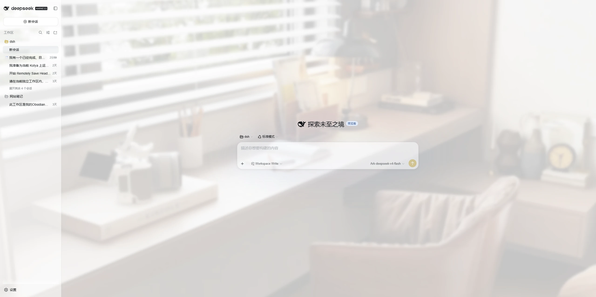
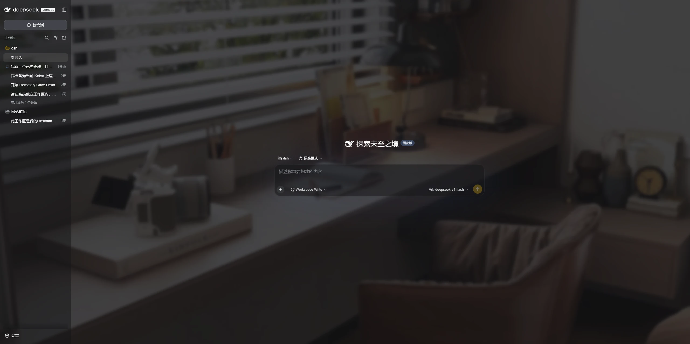
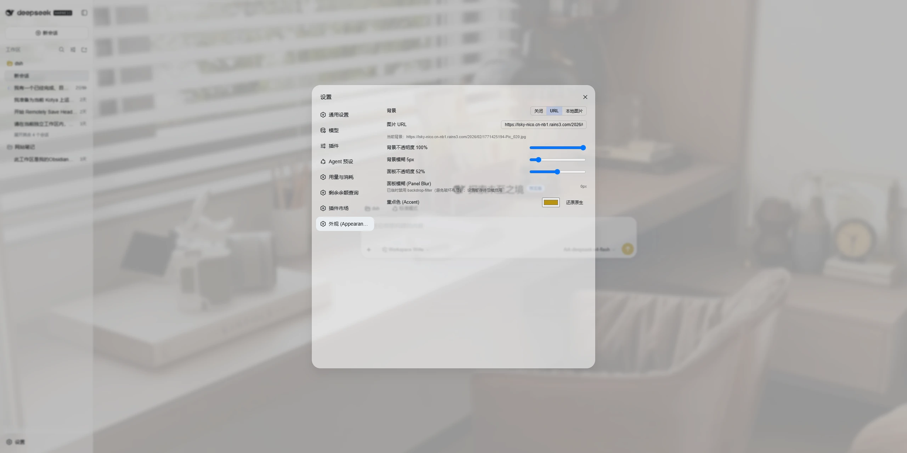

# dsh-ui-liteglass

**LiteGlass** — [English](README.md) | 简体中文

一个轻量级的 DeepSeek Harness 外观皮肤插件。

**Wallpaper. Glass. Accent. 仅此而已。**

## 截图

运行中的真实截图——浅色 / 深色主界面与外观设置页——放在
[`docs/screenshots/`](docs/screenshots/)，并通过
[`screenshots.json`](screenshots.json) 接入市场展示。







## 功能

1. **自定义壁纸**
   - 支持远程图片 URL，或本地上传图片
   - 可调节背景不透明度与背景模糊

2. **玻璃质感面板**
   - 可调节面板透明度，营造轻量的玻璃质感

3. **重点色 (Accent)**
   - 自定义 DSH 界面中受支持状态的重点色
   - 自动适配 DSH 原生浅色 / 深色外观

## 差异化

- **服务端持久化、多设备一致**：设置与上传壁纸保存在 DSH 主机端（而非浏览器），
  任何能访问主机的设备都看到同一套外观。
- **不接管原生颜色模式**：Light / Dark / System 完全由 DSH 原生设置管理，
  插件只在其之上增强外观。
- **不建立第二套主题系统**：基于官方 `theme.overrideTokens` 缝与 DSH token 体系，
  无自带 CSS 框架、无竞争主题模型。
- **小巧、专注、可预期**：壁纸 + 玻璃 + 重点色，仅此而已。

## 身份标识 (Identity)

| 字段 | 值 |
|---|---|
| package | `dsh-ui-liteglass` |
| display name | **LiteGlass** |
| plugin id（client module / settings.section / theme source） | `dsh-ui-liteglass` |
| rowId / wiring.id（loader entry / skin-market） | `ui-liteglass` |

`rowId` 与 `cordis.patch.yml` 中的 loader entry id 一致，皮肤市场用它做互斥接线。
权威记录见 `docs/IDENTITY.md`。

## 兼容性

- **Supported（声明支持）**：DeepSeek Harness `0.1.0-rc` 系列（当前 release-candidate
  线）。插件只使用稳定的官方缝（`webServer`、`settings`、`theme.overrideTokens`、
  `dsh.client` inject）。
- **Tested with（已验证）**：DeepSeek Harness `0.1.0-rc.7`（开发运行时；client theme
  bundle `0.1.0-rc.8`）。

DeepSeek Harness 仍在快速迭代，未来版本可能改变插件接口；以上支持范围是声明，
而非向前兼容承诺。

## 安装

从 npm（发布后）：

```sh
dsh plugin --profile web add dsh-ui-liteglass
```

或直接从 GitHub 仓库安装（现在即可用）：

```sh
dsh plugin --profile web add git+https://github.com/mumuer1024/dsh-ui-liteglass.git
dsh --profile web
```

如需固定到某个具体版本，可在 URL 后附加 tag：

```sh
dsh plugin --profile web add 'git+https://github.com/mumuer1024/dsh-ui-liteglass.git#v0.1.0'
```

`dsh plugin add` 会在首次使用时初始化 profile，并自动接入 bundle。之后启动 Web UI，
打开 **设置 → 外观 (Appearance)** 即可。

## 配置

打开 **设置 → 外观 (Appearance)**（插件在该页新增了自己的分区）：

- **背景**：关闭 / URL / 本地上传；背景不透明度；背景模糊。
- **面板不透明度**：主界面表面的半透明程度。
- **重点色**：选择颜色，或恢复原生值。

配置保存在 DSH 主机端，因此通过不同设备访问时也会使用同一套外观配置。

## 卸载

```sh
dsh plugin --profile web remove dsh-ui-liteglass
```

移除插件后外观会恢复原样。注意：上传的壁纸文件与插件配置位于
`$DSH_HOME/ui-liteglass/`，卸载命令不会删除它们——如需清理，请手动删除该目录。

## 已知限制

- **面板模糊（`backdrop-filter`）目前未启用。** 在当前构建中，对主面板容器施加
  背景模糊会破坏设置页 / 浮层定位，因此该效果被禁用。背景模糊与面板透明是可用的，
  不受影响。
- 颜色模式（Light / Dark / System）始终由 DSH 原生设置控制——本插件不提供颜色模式切换。

## 开发 / 测试

内置 Node 测试覆盖 host 路由、客户端状态模型，以及“不控制颜色模式”的保证：

```sh
node test/host-smoke.mjs && node test/lifecycle.mjs && node test/no-appearance.mjs
```

`npm publish` 会经 `prepublishOnly` 先跑同一套测试。设计细节见 `docs/ARCHITECTURE.md`。

## 许可证

[MIT](LICENSE)
